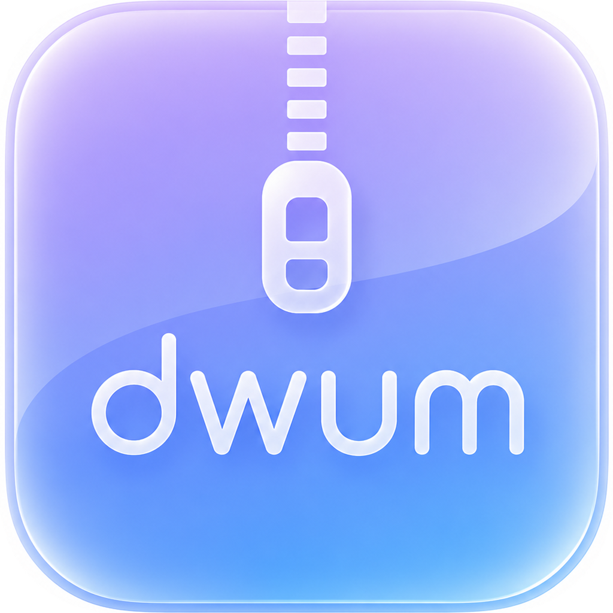

<div align="center">



# DeleteWhenUnzipMac

**The macOS-native archiver that deletes archives while unzipping — APFS hole punching, zero SSD wear**

[](https://www.apple.com/macos/)
[](https://www.apple.com/mac/)
[](https://swift.org)
[](LICENSE)

[The Problem](#the-problem) • [The Solution](#the-macos-native-solution) • [Installation](#installation--quick-start) • [Usage](#usage) • [Testing](#running-the-test-suite)

</div>

> **Notice**: This project is a macOS-native Swift rewrite inspired by and based on [auto-Dog/delete_when_unzip](https://github.com/auto-Dog/delete_when_unzip).
> 
> ⚠️ **Early Development Stage**: DeleteWhenUnzipMac is currently in active early development. Official prebuilt releases (`.dmg` / `.app`) will be available within a few weeks. If you want to try it today, follow the build instructions below to compile from source.

---

## The Problem

When extracting a 50 GB archive on a disk with only 20 GB of free space, standard unarchivers fail immediately with "Disk Full" errors.

The original Python project solves this on Windows by progressively truncating chunks from the input file as data is decompressed. However, on traditional filesystems, repeatedly shifting bytes forward incurs $O(N^2)$ disk writes—extracting 50 GB could cause over 100 TB of repetitive NAND writes on your SSD.

## The macOS Native Solution

**DeleteWhenUnzipMac** is a ground-up rewrite in pure Swift and SwiftUI tailored specifically for Apple Silicon Macs. Intel Macs are not supported:

- **APFS File Hole Punching (`F_PUNCHHOLE`)**: Instead of copying bytes forward on disk, we issue native XNU kernel `fcntl(fd, F_PUNCHHOLE, ...)` calls to deallocate underlying physical blocks in $O(1)$ time. This frees up disk space immediately with **zero extra disk writes and zero SSD wear**.
- **Unified Engine**: Powered directly by `libarchive` via a native C bridge, handling ZIP, RAR, TAR, GZIP, and 7-Zip in a single binary.
- **Multi-Volume Support**: Automatically detects `.part1.rar`, `.z01`, `.zip.001`, `.r01`, and `.7z.001` sequences, safely deleting each volume the moment it has been fully decompressed.
- **Smart Filename Encoding**: Automatically detects UTF-8, GBK/GB18030, Shift-JIS, and CP437 to prevent garbled filenames from Windows archives.
- **Native SwiftUI Interface & CLI**: Comes with a clean Mac desktop app (drag & drop, live disk space monitoring, password prompts) and a scriptable command-line tool.

---

## Installation & Quick Start

### 1. Homebrew (CLI Installation)

Install the standalone `dwum` command with a single line:

```bash
brew install luanyufei/tap/dwum
```

Once installed, run `dwum` directly anywhere:

```bash
dwum archive.zip
```

To update `dwum` to the latest release at any time:
```bash
dwum update
```

---

### 2. Building from Source (GUI App & CLI)

#### Prerequisites
- Apple Silicon Mac (arm64). Intel Macs are not supported.
- macOS 13.0 (Ventura) or later
- Xcode Command Line Tools (`xcode-select --install`)
- `libarchive` headers: `brew install libarchive`

#### Build
```bash
git clone https://github.com/luanyufei/delete_when_unzip_mac.git
cd delete_when_unzip_mac
chmod +x build_macos.sh
./build_macos.sh
```

This generates:
1. **`DeleteWhenUnzipMac.app`** (macOS GUI App in the project root)
2. **`.build/bin/dwum`** (CLI executable)

---

## Usage

### 1. GUI App

Double-click `DeleteWhenUnzipMac.app` in Finder or run:

```bash
open DeleteWhenUnzipMac.app
```

- Drag and drop any archive or the first volume into the window.
- The app automatically identifies the format, volume count, and target folder.
- Review the destructive extraction warning, enter a password if required, and click **Start Extraction**.

### 2. Command Line (`dwum`)

```bash
# Basic extraction with default 10 MB chunk size
dwum game.zip

# Multi-volume archive with custom 50 MB chunk size and password
dwum game.part1.rar 50 mypassword

# Check version
dwum --version

# Self-update to latest release
dwum update
```

---

## Running the Test Suite

We include an automated verification suite that tests APFS hole punch detection, filename encoding fallbacks, volume scanners, and an end-to-end extraction and deletion cycle:

```bash
xcrun swiftc -sdk $(xcrun --show-sdk-path) \
  -parse-as-library \
  -I .build/modules \
  -I Sources/Clibarchive \
  -L .build/modules \
  -lDeleteWhenUnzipCore \
  -I /opt/homebrew/opt/libarchive/include \
  -L /opt/homebrew/opt/libarchive/lib \
  -larchive \
  -Xlinker -rpath -Xlinker "@executable_path/../modules" \
  -Xlinker -rpath -Xlinker /opt/homebrew/opt/libarchive/lib \
  Tests/VerificationRunner.swift \
  -o .build/bin/run_tests && ./.build/bin/run_tests
```

---

## Acknowledgments & License

- Original Python implementation: [@auto-Dog](https://github.com/auto-Dog) / [delete_when_unzip](https://github.com/auto-Dog/delete_when_unzip)
- macOS Native Swift port: [luanyufei](https://github.com/luanyufei)
- Licensed under the Apache License 2.0.
